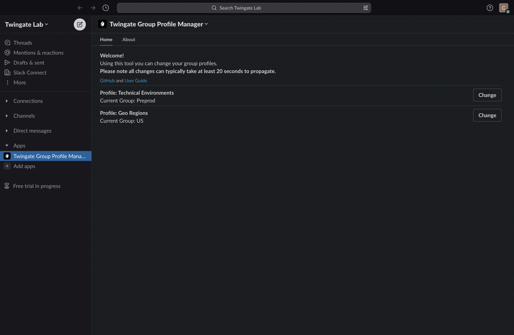
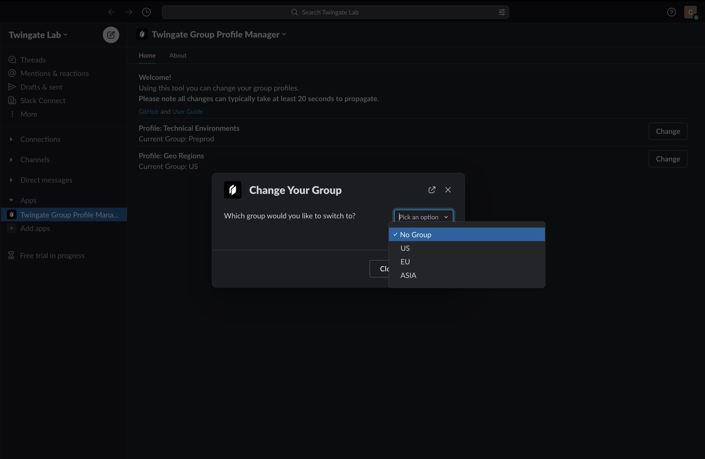

# tg-group-profile-manager
This repository consists of a Slackbot that allows Twingate users to self-serve access to different groups according to policies defined by their network administrators. In essence, it brings the concept of _profiles_ to Twingate.

Typical use cases:
* Manage access to resources that share the same IP addresses or DNS names
* Segregate access to different environments (e.g. Development, Test, Production environments)
* Switch between resources in different geographic regions

Profiles can be configured in JSON and access to each profile can be restricted based on group membership. Currently the only profile type that is supported is a `one-of` pattern that ensures a user can only be in a single group from a set of possible groups.

## Prerequisites
1. Slack Workspace (with admin access to deploy)
2. A [Twingate](https://www.twingate.com/) account
3. Ability to deploy a Slackbot (instructions below)

## Install Steps
### Create and setup Slack App
1. Create New Slack app from a manifest [here](https://api.slack.com/apps)
2. Paste the content from [manifest.yaml](./manifest.yml)
3. Install the Slack app to your Workspace
4. Retrieve the _signing secret_ from the `Basic Information` page and _bot token_ from `OAuth & Permissions` page

### Configuration
Please prepare the following configuration parameters (refer to the [example file](./tg-group-profile-manager.conf)):
 - `SLACK_SECRET` Slack signing secret
 - `SLACK_BOT_TOKEN` Slack bot token (begins with `xoxb-`)
 - `TG_API_KEY` can be generated in the Setting page within the Twingate Admin Console (Read and Write permission is required)
 - `TG_ACCOUNT` replace with your Twingate Network Address (e.g. _test1.twingate.com_)
 - `PROFILE_CONFIG` Your profile configuration (see notes and guidance in the [schema documentation](./docs/SCHEMA.md))

### Deploy on Google CloudRun (CloudRun Button)
1. Ensure you have the following pre-requisites:
    - All configuration parameters from the `Configuration` section above
    - `PROJECT_ID` GCP Project (will be passed to container for it to access secrets)
    - Google Cloud project owner
3. Click and follow the steps in GCP CloudShell, entering the configuration parameters when prompted:

The `Run on Google Cloud option` will prompt for all pre-requisite parameters during setup and store them as secrets. For a full description of the executed steps please see [`app.json`](./app.json).

For a manual deployment you may instead follow the [manual instructions](./docs/MANUAL_DEPLOYMENT.md) 

### Complete setup in Slack App UI
1. Go to your app at [Slack App UI](https://api.slack.com/apps)
3. Event Subscription
   * Replace the Request URL to `https://{Your tg-group-profile-manager URL}/slack/events`
* Interactivity & Shortcuts
   * Replace the Request URL to `https://{Your tg-group-profile-manager URL}/slack/events`
4. Download the [Twingate Logo](./Twingate%20Logo%20-%20Icon.png) and change the logo of the Slack app in the `Basic Info` page.

### Current limitations & known issues
1. When there are Twingate groups with duplicate names, only the first group returned by the Twingate API is used. To prevent this, ensure there are no duplicate group names in the Twingate network.
3. The Slack users' email addresses needs to be the same as their Twingate email address.
4. Group changes will be passed to any connected clients automatically without the need to disconnect and reconnect but please advise end-users that this process can take ~20 seconds to pass through to connected clients.
